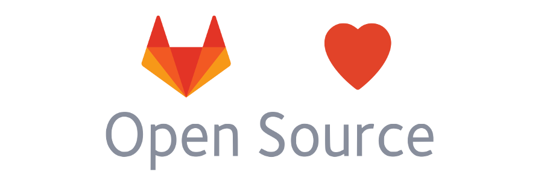

# GitLab top tiers are free for Open Source Projects

GitLab exists today in large part thanks to the work of a vast community of open source contributors around the world. As a company, we are deeply committed to being a good [steward for the Open Source project](https://about.gitlab.com/stewardship). To give back to this community who gives us so much, we want to enable teams be more efficient, secure, and productive. We believe the best way for them to achieve this is by using as many of the capabilities of GitLab as possible.

As such, we are offering a complimentary license to GitLab Ultimate (self-hosted) or subscription to GitLab Gold (SaaS) to any Open Source project using GitLab.

## Benefits

- Free Ultimate license (self-managed), or alternatively free Gold subscription (hosted at gitlab.com) for Open Source projects.
- Optional paid support at a 95% discount ($4.95/user/month instead of $99/user/month).

## Requirements

To be eligible:
- You need to be a project lead or a core contributor for an active open source project.
- Your project needs to be under an [OSI-accepted open source license](https://opensource.org/licenses/alphabetical)
- Your project **must not seek to make profit from the resulting project software**.

If you or your company work on commercial projects, please consider our [plans for businesses](https://about.gitlab.com/pricing/) instead.

If you are not sure whether your project meets these requirements, please send us an email at [opensource@gitlab.com](mailto:opensource@gitlab.com) and we will be happy to help.

## How to apply

1.   [Create a gitlab.com account](https://gitlab.com/users/sign_in) if you do not have one already
1.   [Create a fork of this project](https://gitlab.com/gitlab-com/marketing/community-relations/opensource-program/gitlab-oss/forks/new)
1.   Edit the [`oss_projects.yml` file](data/oss_projects.yml) and add an entry for your project using this template:
     ```yaml
     -
     project_name: 'Project awesome'
     project_description: 'Describe what your project is about.'
     project_url: 'https://projectawesome.org (if you don't have a project site, use the GitLab project URL)'
     gitlab_plan: Gold or Ultimate
     ```
1.   Commit the changes to your fork and submit a new Merge Request against this project.
1.   Fill out the form at our [OSS page](https://about.gitlab.com/solutions/open-source/)


We'll review all requests and accept them at our discretion. If accepted, your project will be listed below and we will send you a quote.

## License and subscription details

- Once your application has been accepted, you'll be granted either a free license for GitLab Ultimate or a free subscription for GitLab Gold.
- Either of those will be valid for 1 year. After that period, a renewal will be required, which will be at no cost.
- Paid support is not included, but can be optionally purchased at a 95% discount ($4.95/user/month).
- You can also purchase support after your application has been accepte by directly [contacting the GitLab Sales team](https://about.gitlab.com/sales/).
- Your license or subscription can be renewed each year for free if your project still meets the requirements.
   - [Contact Sales](https://about.gitlab.com/sales/) 30 days before your license or subscription ends for the renewal.
- Licenses and subscriptions cannot be transferred or sold.
